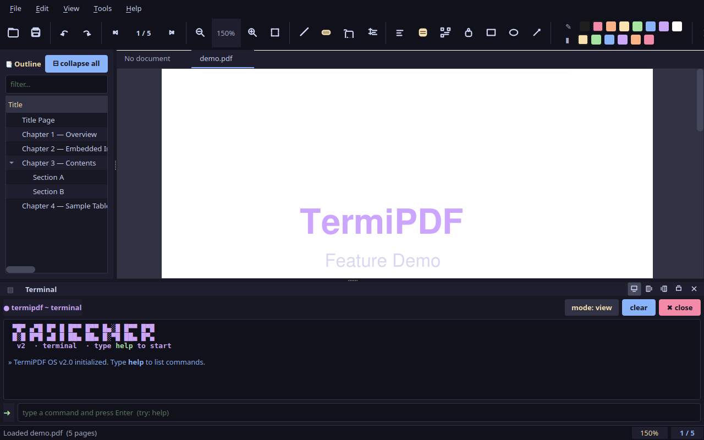
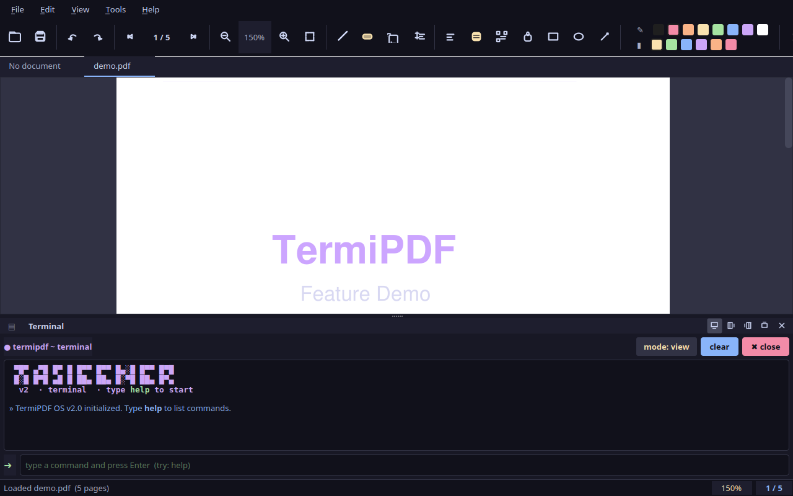
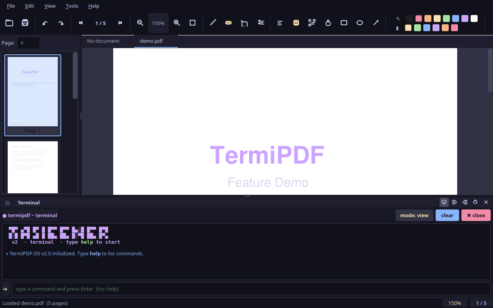
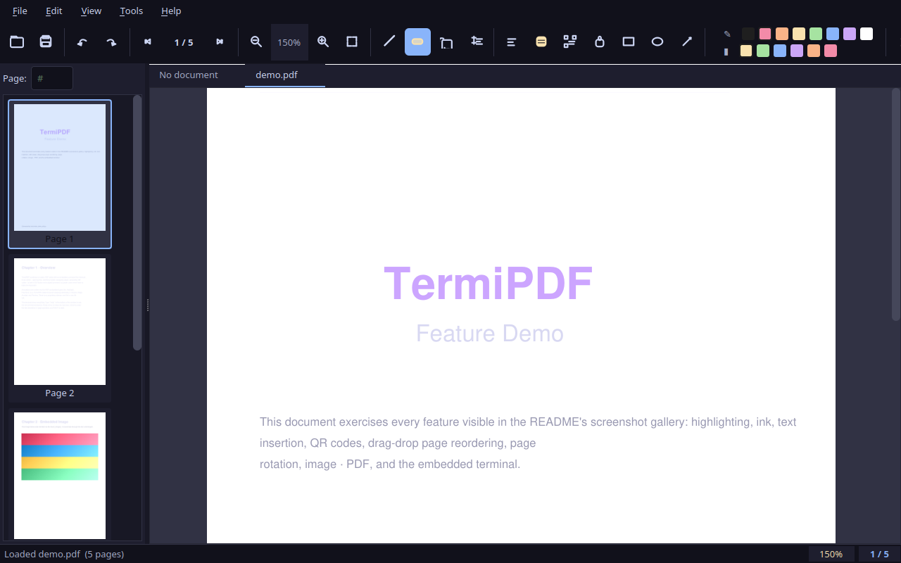
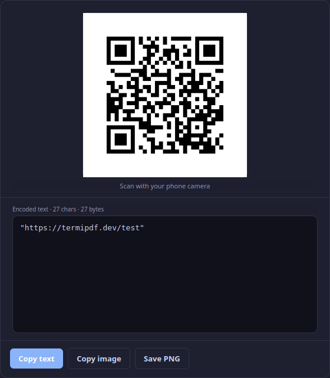
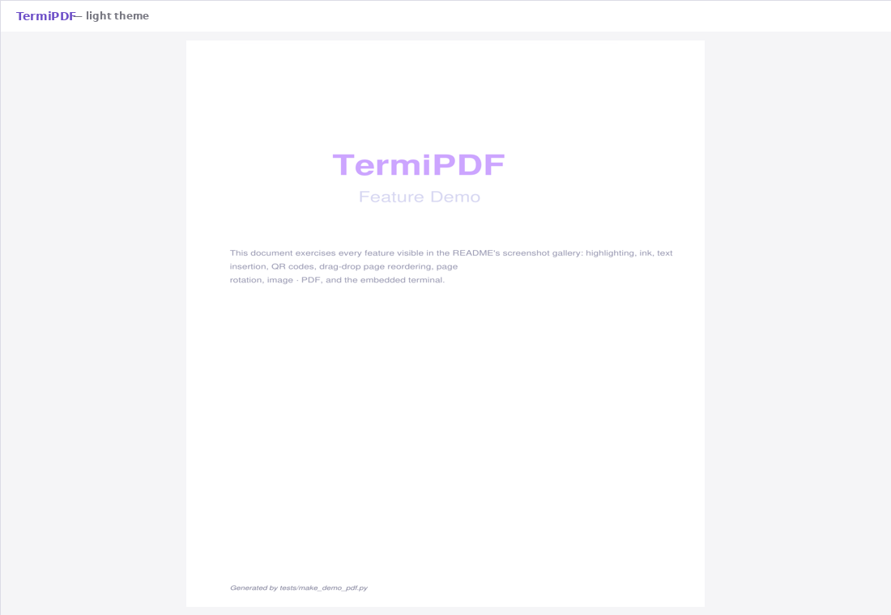
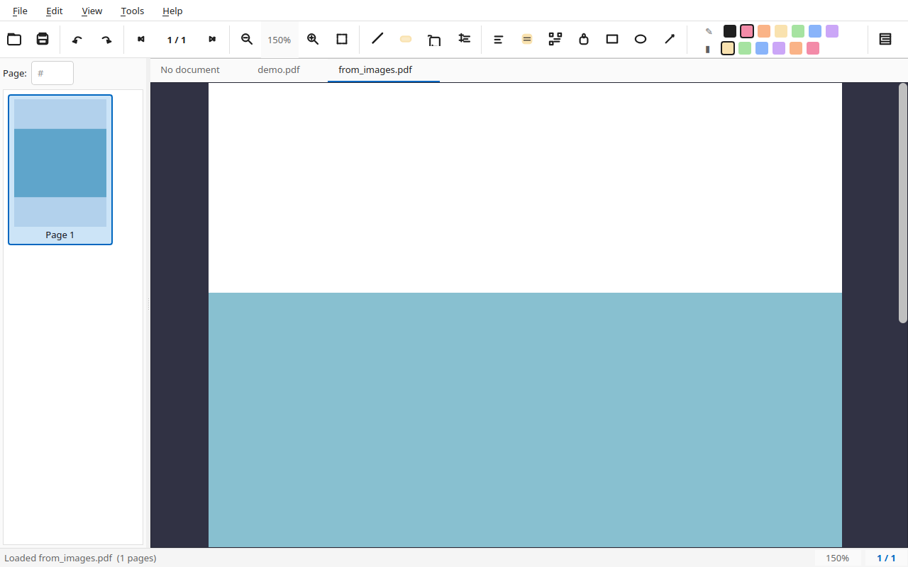
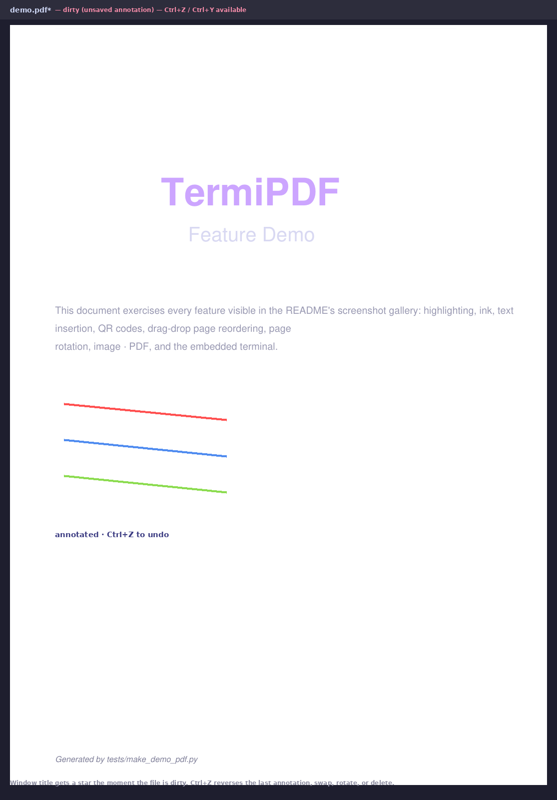

# TermiPDF

> A modern PDF editor with an embedded terminal. Open, annotate, edit, reorder, and screenshot — every action lives one keystroke away.

    [](https://snapcraft.io/termipdf)

---

## ✨ Features

### 📄 Viewer
- Open any PDF and flip through pages with `next`, `prev`, `goto`, or `Ctrl+Click` on a thumbnail.
- Built-in outline (TOC) sidebar — every chapter heading you add shows up automatically.
- Thumbnail rail for fast visual navigation.
- Zoom controls: `zoom in`, `zoom out`, `zoom 1.5`, `fit`.
- Drag-and-drop `.pdf` files onto the window to open them.
- **Drag-drop images onto the viewer** to convert them straight into a multi-page PDF (`image2pdf`).

### 🖊️ Annotator
- **Freehand ink** in any colour and thickness (`mode draw --color red --thickness 3`).
- **Highlight rectangles** drawn directly on the page, or auto-highlight every occurrence of any phrase (`highlight "search text"`).
- **Erase** mode — click any annotation to remove it.
- **Shapes**: rectangles, ellipses, arrows.
- **Sticky notes** and on-page **text insertion** (with full Unicode / Bangla support via embedded TTF).
- **Signature** mode — draw once, save as a reusable stamp.
- All annotations are written into the PDF as standard types (Ink, Highlight, FreeText), so Chrome, Edge, Adobe, and Preview display them as authored.

### ✂️ Editor
- `extract 1 3 out.pdf` — pull a page range into a new file.
- `merge a.pdf b.pdf merged.pdf` — concatenate two (or more) PDFs.
- `split 4 left.pdf right.pdf` — split a PDF in two at page 4.
- `gen npdf p-1,3,5 out.pdf` — generate a new PDF from selected pages of the current one.
- `image2pdf a.png b.jpg out.pdf` — convert images into a multi-page PDF (or just drag them into the window).
- `delete 2`, `rotate 1 90`, `swap 1 3` — page-level mutations.
- **Per-text styles**: `addtext` for free-form text, `edit-text` to whiteout-and-replace.
- **Undo / Redo** (`Ctrl+Z` / `Ctrl+Y`) covers everything: annotations, swaps, rotations, deletes, moves.

### 🔎 Search
- `find <text>` opens the find bar and highlights every match in the document.

### 🔳 Tools
- `qr "url"` opens a QR-share popup with a live preview.
- `screenshot page` saves the current page as PNG (and copies it to your clipboard).
- `screenshot region` invokes your OS's native screenshot tool.

### 🪟 UI
- Dark and light themes (`theme dark | light`).
- Fullscreen (`F11`).
- Dockable terminal — move it to bottom / left / right / top / float (`dock ...`).
- Single-page or continuous-scroll view (`view single | continuous`).
- Print (`Ctrl+P`) supports any printer your OS exposes.

---

## 📸 Screenshots

| | | |
|---|---|---|
| <br>**PDF viewer** with the demo document open | <br>**Outline sidebar** showing chapter headings | <br>**Thumbnail rail** for fast navigation |
| <br>**Freehand ink** — multi-colour, variable thickness | <br>**Auto-highlight** every occurrence of a phrase | <br>**Unicode text insertion** (incl. Bangla) |
| <br>**Pages Manager** — drag-drop reorder, swap, delete, rotate | <br>**Embedded terminal** with the full command reference | <br>**QR-share popup** with live PNG preview |
| <br>**Light theme** variant | <br>**Image → PDF** pipeline (drag-drop or `image2pdf`) | <br>**Undo / Redo** for every annotation and page op |

<sub>Generated by <code>tests/capture_screenshots.py</code> against the bundled demo PDF (<code>tests/make_demo_pdf.py</code>).</sub>

---

## 🚀 Quick Start

### Ubuntu (one command)
```bash
sudo snap install termipdf
```
Then launch **TermiPDF** from your application menu, or:
```bash
termipdf
```

### Debian / Ubuntu via .deb
Download `termipdf_0.1.0-1_amd64.deb` from the
[Releases page](https://github.com/shuv-on/TermiPDF/releases), then:
```bash
sudo dpkg -i termipdf_0.1.0-1_amd64.deb
sudo apt-get install -f         # resolves missing apt deps if any
termipdf
```
The `.deb` pulls PyQt6 + PyMuPDF + Pillow + qrcode from apt
(`python3-pyqt6`, `python3-fitz`, `python3-pil`, `python3-qrcode`)
so no `pip install` is needed. See **[TESTING.md](TESTING.md) § 5**
for how to build the .deb from source.

### From source
#### 1. Requirements
- Python **3.10 or newer**
- A desktop environment (Linux, Windows, or macOS)
- `requirements.txt` (4 packages): **PyQt6 ≥ 6.5**, **PyMuPDF ≥ 1.23**, **qrcode ≥ 7.4**, **Pillow ≥ 10**

#### 2. Install
```bash
git clone <repo-url> TermipDF
cd TermiPDF
python3 -m venv .venv
source .venv/bin/activate          # Linux / macOS
# .\.venv\Scripts\activate         # Windows (PowerShell)
pip install -r requirements.txt
```

#### 3. Run
```bash
python src/main.py
```

A window opens with three panels:

```
┌──────────┬─────────────────────┐
│  Outline │   PDF Canvas        │
│  (TOC)   │                     │
│          │                     │
├──────────┴─────────────────────┤
│  💻 Terminal                    │
└─────────────────────────────────┘
```

### 4. Open a PDF
- **Drag** any `.pdf` file from your file manager onto the window, **or**
- Type in the terminal: `open /path/to/your/file.pdf`
- **Drag images** (`.png`, `.jpg`, `.webp`, `.avif`, `.tif`, `.bmp`) onto the window to convert them to a PDF on the spot.

---

## ⌨️ The Terminal — Your Command Center

Click the input box at the bottom (or press `Ctrl+L`) and start typing. Run `help` for the full reference. Quick tour:

### Navigation
| Command | What it does |
|---|---|
| `open <path>` | Open a PDF |
| `close` | Close the current PDF |
| `next` / `prev` | Next / previous page |
| `goto 5` | Jump to page 5 |
| `zoom in` / `zoom out` / `zoom 1.5` | Zoom controls |
| `fit` | Fit page to viewport |
| `toc` / `thumbs` | Toggle outline / thumbnail sidebar |
| `find <text>` | Search & highlight all matches |

### Annotate
| Command | What it does |
|---|---|
| `mode draw --color red --thickness 3` | Freehand ink — then click and drag on the canvas |
| `mode highlight --color yellow` | Drag a rectangle to highlight |
| `highlight "search text" --color yellow` | Auto-highlight every occurrence |
| `mode erase` | Click any annotation to delete it |
| `mode rect` / `ellipse` / `arrow` / `note` | Shape tools |
| `mode signature` | Draw a signature, save it for re-use |
| `mode text` / `mode edit-text` | Insert / replace text on the page |
| `addtext "Hello" --page 1 --x 100 --y 200 --size 14` | Insert Unicode text |
| `undo` / `redo` | Ctrl+Z / Ctrl+Y of every change |
| `save` | Write annotations into the PDF |

### Edit
| Command | What it does |
|---|---|
| `extract 1 3 out.pdf` | Extract pages 1–3 to a new file |
| `merge a.pdf b.pdf merged.pdf` | Combine two PDFs |
| `gen npdf p-1,2,3 out.pdf` | Generate a new PDF from selected pages |
| `image2pdf a.png b.jpg out.pdf` | Convert images to a multi-page PDF |
| `split 4 left.pdf right.pdf` | Split at page 4 |
| `delete 2` / `rotate 1 90` / `swap 1 3` | Page-level operations |
| `screenshot page` | Save current page as PNG (+ clipboard) |
| `screenshot region` | OS-native screenshot tool |

### UI
| Command | What it does |
|---|---|
| `theme dark` / `theme light` | Switch theme |
| `fullscreen` | F11 fullscreen |
| `view single` / `view continuous` | Switch the page-scroll mode |
| `dock bottom` / `left` / `right` / `top` / `float` | Move the terminal dock |
| `print` | Open the OS print dialog |
| `qr "https://example.com"` | QR-share popup |
| `help` / `clear` / `history` / `exit` | General |

### Keyboard Shortcuts
| Shortcut | Action |
|---|---|
| `Ctrl+O` | Open a PDF |
| `Ctrl+S` | Save (write annotations into the PDF) |
| `Ctrl+B` | Toggle the outline sidebar |
| `Ctrl+Shift+B` | Toggle the thumbnail rail |
| `Ctrl+\`` | Toggle the terminal dock |
| `Ctrl+L` | Focus the terminal input |
| `Ctrl+F` | Open the find bar |
| `Ctrl+P` | Print |
| `Ctrl+J` | Show/hide terminal |
| `Ctrl+Shift+G` | Open the Pages Manager |
| `Ctrl+Z` / `Ctrl+Y` | Undo / Redo |
| `Ctrl+Shift+S` | Screenshot (current page → PNG + clipboard) |
| `F11` | Fullscreen |
| `↑` / `↓` | Cycle command history |

---

## 🌏 Bangla / Unicode Text

To render Bangla (বাংলা) text correctly inside the PDF:

1. Drop a Unicode Bangla TTF font into `src/shared/assets/`. Suggested fonts:
   - `Kalpurush.ttf`
   - `NotoSansBengali.ttf`
2. TermiPDF auto-detects the font and embeds it into the PDF.
3. Insert with:
   ```
   addtext "আমার সোনার বাংলা" --page 1 --x 100 --y 500 --size 18
   ```

Without a TTF, non-Latin scripts may render as boxes — the font is essential.

---

## 💾 Saving & Cross-Reader Compatibility

When you type `save` (or press `Ctrl+S`), TermiPDF writes annotations **directly into the PDF file**. The resulting PDF displays all drawings, highlights, text, and QR stamps in:

- ✅ Google Chrome
- ✅ Microsoft Edge
- ✅ Adobe Acrobat Reader
- ✅ Mozilla Firefox (built-in viewer)
- ✅ macOS Preview

This works because TermiPDF uses **standard PDF annotation types** (Ink, Highlight, FreeText) rather than overlay images.

---

## 🎨 Theming

Two themes ship out of the box — dark (default) and light. Toggle from the terminal (`theme dark | light`) or the **Theme** menu. Both share the same Dracula × Nord hybrid palette:

- Background (dark): `#1e1e2e`
- Foreground: `#cdd6f4`
- Accent: `#cba6f7` (purple)
- Success: `#a6e3a1`
- Error: `#f38ba8`

Styles live in `src/shared/styles/theme_dark.qss` and `theme_light.qss`.

---

## 🧪 Sanity Check

```bash
source .venv/bin/activate
python tests/smoke_test.py
```

You should see `ALL 108 CHECKS PASSED ✓` at the bottom. The suite exercises page-level ops, rotation, swapping, deletion, image-to-PDF, QR generation, the recent-files store, and every text/annotation engine.

For a complete testing guide (interactive UI walkthrough, headless
screenshot capture, snap packaging, cross-device install), see
**[TESTING.md](TESTING.md)**.

---

## ❓ Troubleshooting

**Q: The window doesn't open.**
A: Make sure the venv is active (`source .venv/bin/activate`), then check Qt:
`python -c "import PyQt6; print('ok')"`.

**Q: Bangla (or other non-Latin text) shows as boxes.**
A: Drop a TTF font covering your script into `src/shared/assets/`. Restart the app so the auto-detect re-runs.

**Q: I drew something but it disappeared after re-opening.**
A: TermiPDF saves in two places: (1) annotations persist in the **PDF itself** once you `save` — re-open the file and they are still there; (2) the in-memory session persists until you `close`. If you made annotations and forgot to `save`, they're lost on close.

**Q: `screenshot region` says "no tool found".**
A: Install a screenshot utility — `gnome-screenshot`, `grim`, `flameshot`, or `scrot` on Linux; Snipping Tool / PowerShell on Windows.

**Q: `save` says "permission denied".**
A: The file is read-only or open in another program. Close it elsewhere, or save to a new path with `extract` / `merge`.

**Q: Where are my command-history entries?**
A: Press `↑` / `↓` in the terminal input — the last 200 commands are remembered for the session.

---

## 📂 Project Layout

```
TermiPDF/
├── README.md                 # ← you are here (end-user + developer guide)
├── LICENSE                   # MIT
├── requirements.txt          # 4 packages
├── docs/
│   └── screenshots/          # Generated gallery (committed)
├── src/
│   ├── main.py               # Entry point — QApplication + theme
│   ├── main_window.py        # Orchestrator — wires features together
│   ├── shared/               # Assets, styles, utilities
│   └── features/             # Feature folders (no cross-feature imports)
│       ├── pdf_viewer/       # Engine, UI, TOC, thumbs, Pages Manager
│       ├── pdf_annotator/    # Ink, highlight, shapes, signatures
│       ├── pdf_editor/       # extract, merge, swap, undo stack
│       ├── qr_generator/     # QR + share popup
│       └── terminal/         # Command parser + terminal UI
└── tests/
    ├── smoke_test.py         # 108 headless checks
    ├── gui_integration_test.py
    ├── make_demo_pdf.py      # Builds docs/screenshots/_assets/demo.pdf
    └── capture_screenshots.py # Re-renders the README gallery
```

See the **Developer Guide** below for architecture, the feature-slicing rules, and the extension points.

---

## 🛠️ Developer Guide

> For contributors: architecture, design decisions, extension points, and development workflow.

### 🎯 Design Goals

1. **Feature-Based (Vertical Slice) Architecture** — every feature owns its own UI, logic, and command handlers. No cross-feature imports.
2. **Decoupled Routing** — the terminal parser dispatches via *callbacks registered by `main_window`*, never via direct feature-to-feature calls.
3. **Cross-Reader PDF Fidelity** — annotations must be visible in Chrome, Edge, and Adobe. We use standard PDF annotation types (Ink, Highlight, FreeText) rather than overlay images.
4. **Unicode-First** — full support for non-Latin scripts (Bangla, Arabic, CJK) via TTF embedding.

### 🧰 Tech Stack

| Layer | Tech | Version |
|---|---|---|
| GUI | PyQt6 | ≥ 6.5 |
| PDF engine | PyMuPDF (fitz) | ≥ 1.23 |
| QR / Image | qrcode + Pillow | ≥ 7.4 / ≥ 10.0 |
| Language | Python | ≥ 3.10 |

### 🏛️ Architectural Rules (Strict)

#### 1. Feature Isolation
A feature folder **must not** import from another feature folder. The chain is always:

```
terminal.command_parser ← main_window ← features.*
```

`main_window.py` is the only file allowed to import across features. If you find yourself adding `from features.X import Y` inside `features/Z/`, **stop** — register the operation through `main_window` instead.

#### 2. Command Registration (Not Hardcoded Dispatch)
The parser doesn't know any feature-specific command. Instead, `main_window._register_commands()` calls:

```python
self.parser.register("open", self._cmd_open)
self.parser.register("mode", self._cmd_mode)
# … etc
```

Each handler returns a `CommandResult` dataclass (`print | clear | exit | error`).

#### 3. Qt Point ↔ PDF Point Conversion
The canvas always speaks in **PDF user units** at the layer above (`AnnotationEngine`, `TextEditor`). The widget layer (`PDFViewerUI`) handles scaling. Use the helpers:

```python
pt_pdf  = self.pdf_viewer.widget_to_pdf(widget_pos)
pt_wid  = self.pdf_viewer.pdf_to_widget(pdf_pt)
```

#### 4. Save Strategy
**In-place saves use `os.replace(tmp, original)`** rather than PyMuPDF's `incremental=True`. This works around two PyMuPDF restrictions:

- `incremental=True` cannot be combined with `garbage=4`
- Structural edits (`delete_page`, `set_rotation`) reject incremental writes

Annotation-only saves *can* in theory use incremental, but for consistency we use tmp-and-replace everywhere. The `_safe_tmp_path()` helper in `manipulation.py` creates an unguessable per-process temp filename so concurrent saves don't collide.

### 🔌 Extension Points

#### Adding a New Command

1. Implement a handler in `main_window.py`:
   ```python
   def _cmd_my_thing(self, args):
       positional, flags = self.parser.extract_flags(args)
       if not positional:
           return CommandResult.error("Usage: my-thing <arg>")
       # … do the work
       return CommandResult.print("Done!")
   ```
2. Register it in `_register_commands()`:
   ```python
   self.parser.register("my-thing", self._cmd_my_thing)
   ```
3. Add it to the `help_text()` output inside `command_parser.py` — otherwise the user can't see it from the terminal.

#### Adding a New Feature Folder

1. Create `src/features/my_feature/__init__.py` and your modules.
2. From `main_window.py`:
   ```python
   from features.my_feature import my_widget
   self.my_widget = my_widget.MyUI()
   # add to layout
   ```
3. Register any commands via `self.parser.register(...)` if needed.

#### Supporting a New Script (e.g. Arabic, CJK)

1. Add the TTF to `src/shared/assets/`.
2. Add the filename to `_BUNDLED_FONTS` in `text_editor.py` (so auto-detection finds it).
3. No other code changes required — `insert_font()` + HarfBuzz shaping handle the rest.

#### Adding a PDF Source Op (e.g. Crop, Watermark)

1. Add a static method to `features/pdf_editor/manipulation.py`:
   ```python
   @staticmethod
   def crop_page(src, page, x0, y0, x1, y1, out=None) -> tuple[bool, str]:
       # follow the same in-place pattern as delete_page
   ```
2. Wire a `_cmd_crop` in `main_window.py` and `register("crop", ...)`.
3. Push a `page_op` undo entry so the crop is reversible.

### 🧪 Testing

#### Quick Sanity (no display required)

```bash
source .venv/bin/activate
python tests/smoke_test.py
```

Output: `ALL 108 CHECKS PASSED ✓` — exercises every feature against generated fixtures (multi-page undo fixture, image-to-PDF fixture, etc.).

#### GUI Integration Test (offscreen)

```bash
QT_QPA_PLATFORM=offscreen python tests/gui_integration_test.py
```

Boots the actual `TermiPDFWindow` and runs a sequence of commands through the parser.

#### Adding New Tests

- **Headless**: append a `section(...)` block in `smoke_test.py`. Keep tests independent — use `tempfile.mkdtemp()` for any files written.
- **GUI**: append a check after `window._do_open(...)` in `gui_integration_test.py`. Drive the window through `_cmd_*` methods, not by simulating Qt events.
- **Screenshot regeneration**: `tests/make_demo_pdf.py` builds the demo fixture, `tests/capture_screenshots.py` re-renders `docs/screenshots/*.png`.

### 🐛 Known PyMuPDF Quirks (and how we work around them)

| Issue | Workaround |
|---|---|
| `fitz.Point` has attribute `.x` / `.y` (not methods) | Helper `_xx(p)` / `_yy(p)` in `annotation_engine.py` works for both attribute-style and QPointF method-style access. |
| `add_ink_annot` needs `[[(x1,y1), (x2,y2), …]]` (seq-of-seq-of-float-pairs) | We pass `[stroke_path]` not `stroke_path`. |
| `add_ink_annot(...)` then `.set_border_width(...)` is gone in 1.27 | Use `.set_border(width)` with fallback. |
| `incremental=True` rejects garbage / structural edits | In-place saves write to a unique temp file via `_safe_tmp_path()`, then `os.replace()`. |
| `delete_page` on the only page produces a 0-page doc | `manipulation.delete_page` rejects when `n <= 1`. |
| `highlight_text` returns 0 matches silently | That's not an error — display "Highlighted 0 occurrence(s)". |
| PyMuPDF opens PNG images at 150 DPI by default | `images_to_pdf` derives the page rect from `page.rect` of the image-document, not from raw pixel size. |
| `swap` / `move` are not self-inverse | `UndoStack` stores separate `do_src/do_tgt` payloads for forward vs inverse. |

### 🔧 Development Workflow

#### Code Style

- **PEP 8** with 4-space indent.
- Type hints on every public function.
- Private helpers prefixed with `_`.
- Docstrings on every module + every public class.

#### Branching

- `main` — stable, tested
- `feature/<name>` — short-lived branches
- Commit messages: imperative mood (`Add QR generator`, not `Added`)

#### Pre-commit Checklist

1. `python tests/smoke_test.py` → all green
2. `QT_QPA_PLATFORM=offscreen python tests/gui_integration_test.py` → all green
3. `python -m py_compile src/**/*.py` → no syntax errors
4. Manual GUI test: open a PDF, draw, save, reopen in Chrome to confirm cross-reader rendering.
5. (Optional) `python tests/capture_screenshots.py` → screenshots regenerate cleanly.

### 🗺️ Class / Module Cheat-Sheet

| Symbol | Where | Purpose |
|---|---|---|
| `QApplication`, `main()` | `src/main.py` | Bootstrapping + QSS load |
| `TermiPDFWindow` | `src/main_window.py` | Top-level QMainWindow; owns engine + parser + undo stack |
| `CommandParser` | `src/features/terminal/command_parser.py` | Tokenize + dispatch to registered handlers |
| `CommandResult` | `src/features/terminal/command_parser.py` | Standard return dataclass |
| `TerminalUI` | `src/features/terminal/terminal_ui.py` | QWidget with output, input, history |
| `ViewerEngine` | `src/features/pdf_viewer/viewer_engine.py` | fitz.Document wrapper; opens, renders, saves |
| `PDFViewerUI` | `src/features/pdf_viewer/viewer_ui.py` | QScrollArea + QLabel canvas with mouse events |
| `CanvasMode` | `src/features/pdf_viewer/viewer_ui.py` | Enum: VIEW, DRAW, HIGHLIGHT, ERASE, TEXT, … |
| `_CanvasSurface` | `src/features/pdf_viewer/viewer_ui.py` | Internal QLabel subclass for live-stroke overlay |
| `TOCUI` | `src/features/pdf_viewer/toc_ui.py` | QTreeWidget outline with filter & navigate |
| `AnnotationEngine` | `src/features/pdf_annotator/annotation_engine.py` | ink, highlight, highlight_text, erase_at |
| `CanvasEventRouter` | `src/features/pdf_annotator/canvas_events.py` | Hooks PDFViewerUI callbacks to AnnotationEngine |
| `TextEditor` | `src/features/pdf_editor/text_editor.py` | Unicode text insert (TTF auto-detect) |
| `PDFManipulator` | `src/features/pdf_editor/manipulation.py` | extract / merge / delete / rotate / swap / move / reorder / images_to_pdf |
| `UndoStack` | `src/features/pdf_editor/undo_stack.py` | Annotation + page-op undo/redo (Ctrl+Z / Ctrl+Y) |
| `PagesManager` | `src/features/pdf_viewer/pages_manager.py` | Grid view + delete / swap / reorder via drag-drop |
| `QRLogic` | `src/features/qr_generator/qr_logic.py` | generate_image + share popup |
| `RecentFiles` | `src/features/pdf_viewer/recent_files.py` | JSON-backed recent-files store (XDG-aware) |
| `parse_color` | `src/shared/utils/color_utils.py` | Hex / named → (r,g,b) tuple |
| `resolve_user_path` | `src/shared/utils/path_solver.py` | `~`, env vars, normalize |

### 🚧 Future Roadmap

- [ ] Plugins: drop a `.py` file into `src/features/` and `main_window` auto-discovers it.
- [ ] Annotations sidebar (list of all annotations on a page).
- [ ] Search across the PDF with regex.
- [ ] Form filling (AcroForm).
- [ ] Optional async rendering for huge PDFs.
- [ ] i18n: translate the terminal banner / help text.
- [ ] OCR fallback for scanned PDFs (Tesseract optional dependency).

---

## 📜 License

[MIT](LICENSE) — see LICENSE for details.

## 🤝 Contributing

Bug reports and pull requests welcome! Please open an issue first to discuss what you'd like to change.
